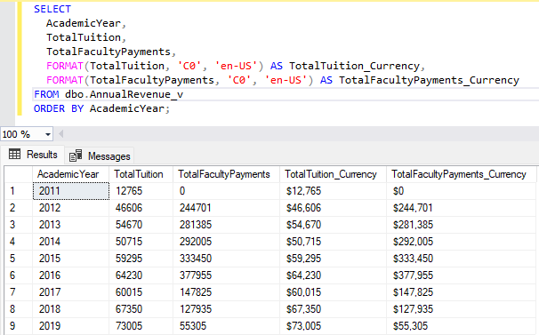
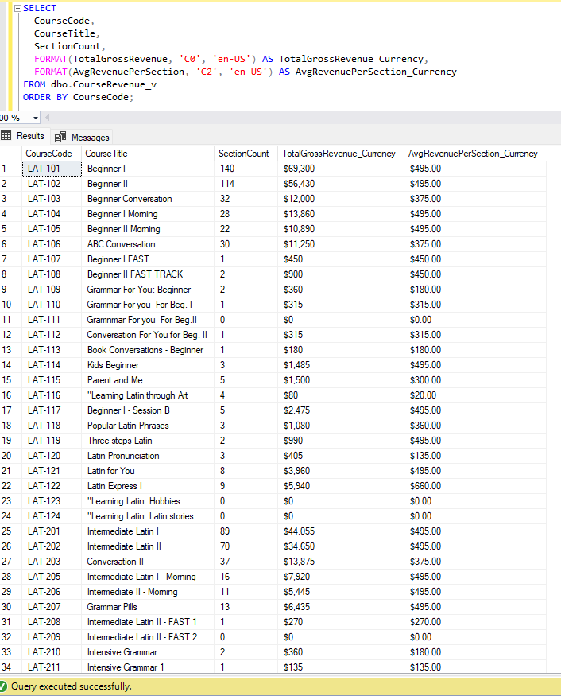
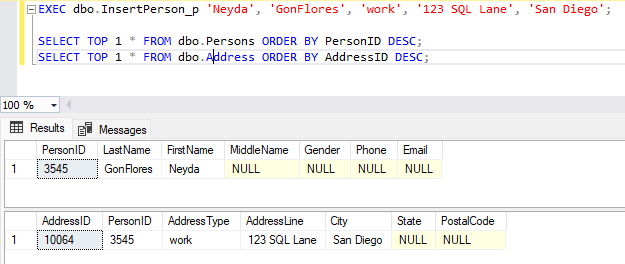
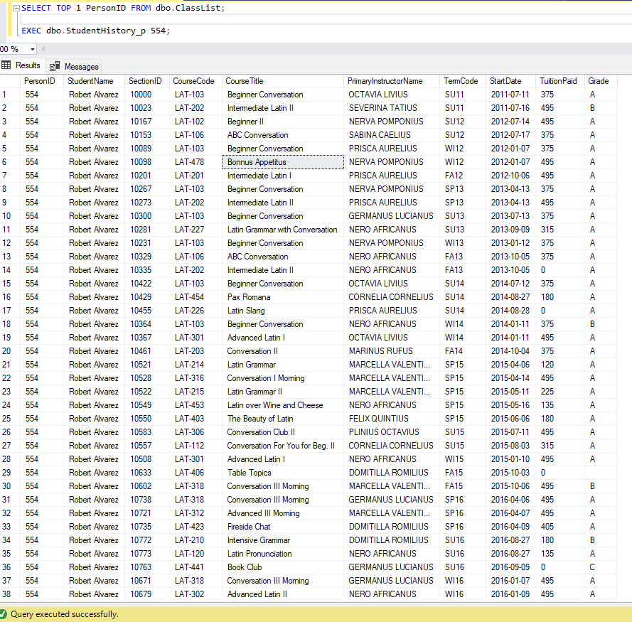
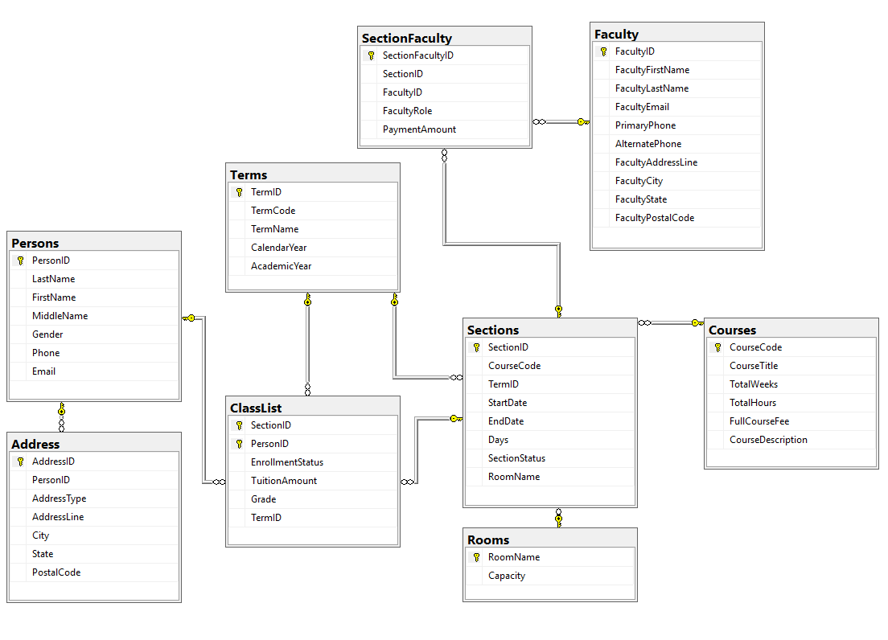

# Latin School SQL Project (UCSD)

## Overview
This project walks through a full end‑to‑end data engineering workflow using the Latin School dataset. I started by cleaning and normalizing the raw Excel files, then built staging tables to validate the data before creating the final SQL Server database from scratch. After importing the cleaned data through SQL Server’s Import Wizard, I wrote SQL queries, views, functions, and stored procedures to analyze enrollment trends, revenue, course offerings, and which instructors teach which sections. The project includes staging, schema design, an ERD, and documented outputs that show how the final relational model works in practice.

## Tools Used
- Excel (initial cleanup)
- SQL Server
- SQL Server Management Studio (SSMS)
- SSMS Database Diagram Tool (for ERD)
- SQL Server Import Wizard

## Folder Structure
- **SQL_scripts/** – SQL scripts for table creation, staging, queries, and stored procedures
- **erd/** – ERD diagram(s)
- **docs/** – project summary
- **screenshots/** – output images from views and stored procedures

## Key Deliverables
- SQL scripts
- ERD diagram
- Final project summary

## SQL Scripts

### Full Script
- [Full Project Script](SQL_scripts/full_script.sql)

### Views
- [Annual Revenue View](SQL_scripts/AnnualRevenue_v.sql)
- [Course Revenue View](SQL_scripts/CourseRevenue_v.sql)

### Stored Procedures
- [Insert Person Stored Procedure](SQL_scripts/InsertPerson_p.sql)
- [Student History Stored Procedure](SQL_scripts/StudentHistory_p.sql)

### Outputs
#### Annual Revenue View Output

#### Course Revenue View Output

#### Insert Person Stored Procedure Output

#### Student History Stored Procedure Output

### ERD

