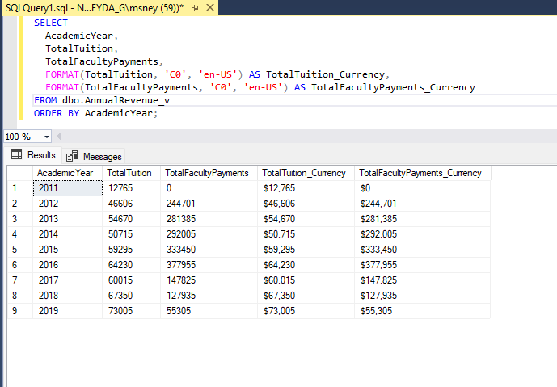
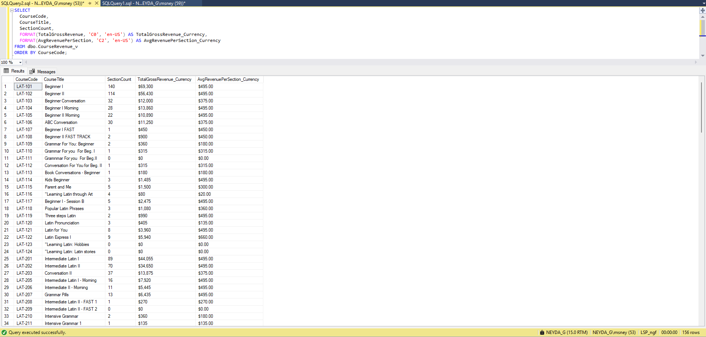
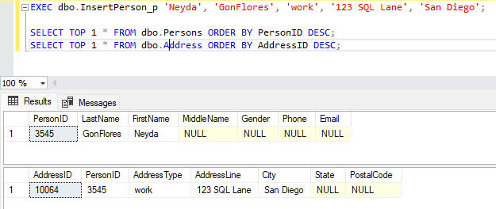
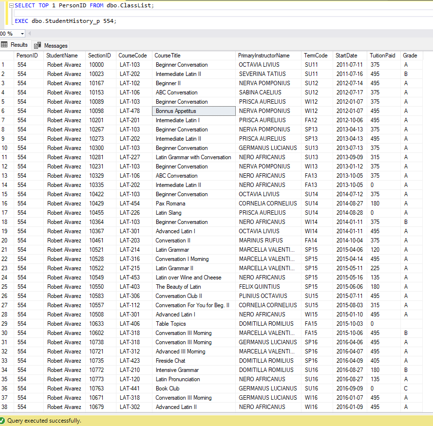

# Latin School SQL Project (UCSD)

## Overview
This project showcases a full end‑to‑end data engineering workflow using the Latin School dataset. The work began with extensive data cleaning and normalization in Excel, followed by creating a brand‑new SQL Server database from scratch. All tables were designed with appropriate keys and constraints, lookup tables were built first, and the cleaned data was imported using SQL Server’s Import Wizard. The project includes staging, schema design, ERD creation, and writing SQL queries, views, functions, and stored procedures to explore and validate the final relational model.

## Tools Used
- Excel (initial cleanup)
- SQL Server
- SQL Server Management Studio (SSMS)
- SSMS Database Diagram Tool (for ERD)

## Folder Structure
- **sql/** – SQL scripts for table creation, staging, queries, and stored procedures
- **erd/** – ERD diagram(s)
- **docs/** – project summary and supporting documents

## Key Deliverables
- ERD diagram
- SQL scripts
- Final project summary

## SQL Scripts
- [Full Project Script](sql/full_script.sql)

## Annual Revenue View Output [Script](sql/AnnualRevenue_v.sql)

## Course Revenue View Output

## Insert Person Stored Procedure Output 

## Student History Stored Procedure Output

## ERD

